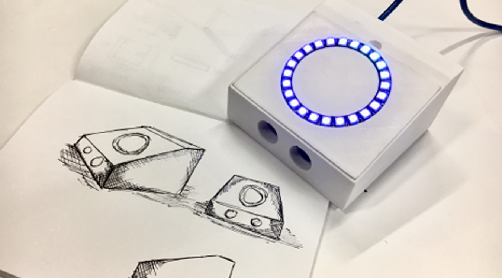

# lights-code-making

Year 1 UI/UX design degree, unit on building a clock with Arduino, Adafruit NeoPixel ring and an real time clock

### Libraries used: 

- RTCLib - *for the real time clock*
- Adafruit NeoPixel - *for the NeoPixel ring* 

